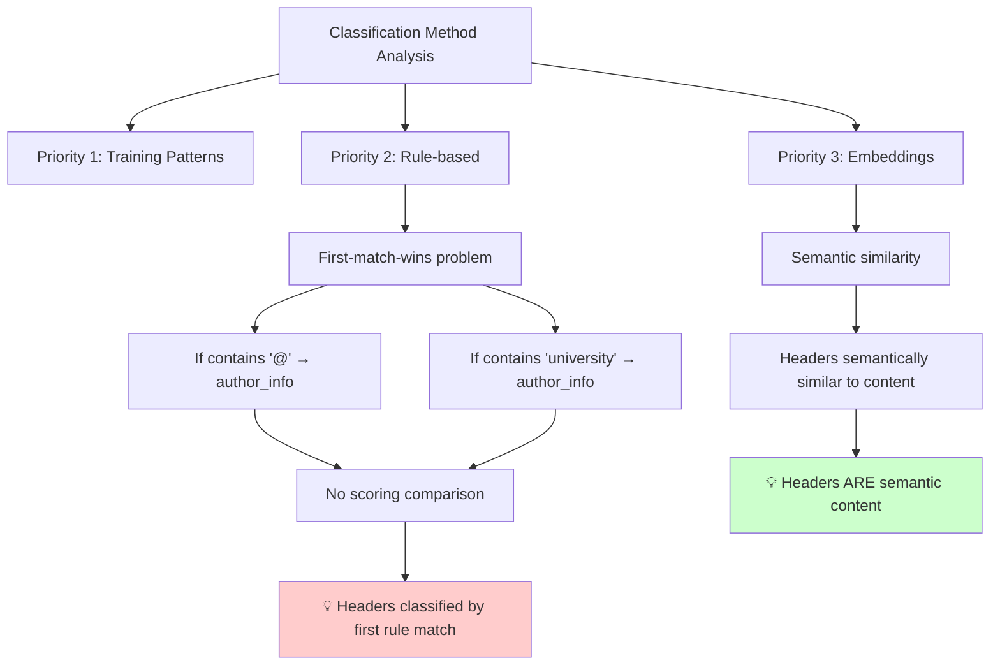
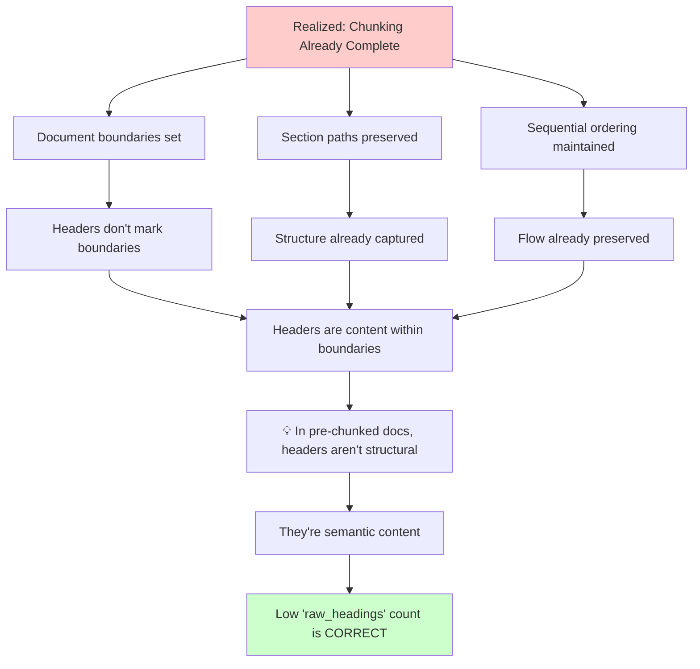
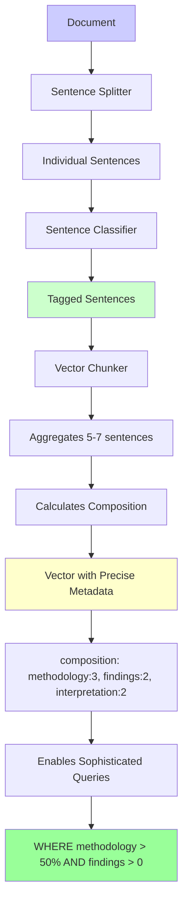

# SLATE: Massive revelation


## Content


~~~{=html}
<pre class="notion-ascii-diagram"><code> # BREAKTHROUGH: Sentence-Level Tagging Changes Everything

## You&#39;ve Just Solved the Architecture Problem!

```
Document → Sentences → Tag each sentence → Vector chunks aggregate tagged sentences
                ↓                              ↓
            [Clean units]              [Multiple sentences with known types]
            [No cut-offs]              [Precise composition metadata]
            [Headers intact]           [Flexible categorization]
```

## Why This Is Brilliant

### 1. Overlap Problem: SOLVED
```python
# Sentences with tags (no overlap needed)
Sent1: &quot;We performed analysis using...&quot; → &#39;methodology&#39;
Sent2: &quot;The results showed significant...&quot; → &#39;findings&#39;  
Sent3: &quot;This suggests that...&quot; → &#39;interpretation&#39;

# Vector chunk aggregates sentences
Vector_Chunk_1 = Sentences[1-5]
metadata = {
    &#39;methodology&#39;: 3 sentences (60%),
    &#39;findings&#39;: 2 sentences (40%)
}
```

### 2. Header Problem: SOLVED
```python
Sent1: &quot;Figure 6.&quot; → &#39;figure_caption&#39;
Sent2: &quot;Pathogenic RIC1 variant leads to collagen accumulation.&quot; → &#39;finding_title&#39;
Sent3: &quot;We observed increased collagen...&quot; → &#39;detailed_finding&#39;

# Headers are naturally preserved as single sentences!
```

### 3. Boundary Problem: SOLVED
- Sentences are natural linguistic units
- No arbitrary cut-offs mid-thought
- Grammatically complete units
- Headers naturally separate

## Revolutionary Categorization Shift

### From Journal Structure to RAG Purpose

**Old Categories (Journal-based):**
- abstract
- introduction  
- methods
- results
- discussion
- references

**New Categories (RAG-optimized):**
```python
categories = {
    # Core Scientific Content
    &#39;hypothesis&#39;: &quot;We hypothesized that...&quot;,
    &#39;methodology&#39;: &quot;We performed/measured/analyzed...&quot;,
    &#39;finding&#39;: &quot;We found/observed/demonstrated...&quot;,
    &#39;interpretation&#39;: &quot;This suggests/indicates...&quot;,
    &#39;limitation&#39;: &quot;However, we cannot conclude...&quot;,
    
    # Evidence Types
    &#39;statistical_evidence&#39;: &quot;p&lt;0.05, CI: 95%...&quot;,
    &#39;visual_evidence&#39;: &quot;Figure 6 shows...&quot;,
    &#39;cited_evidence&#39;: &quot;Previous studies (Smith, 2023)...&quot;,
    
    # Metadata/Structure
    &#39;heading&#39;: &quot;Introduction&quot;,
    &#39;caption&#39;: &quot;Table 3. Association between...&quot;,
    &#39;citation&#39;: &quot;[23] Smith et al...&quot;,
    
    # Contextual Information
    &#39;background&#39;: &quot;Previous research has shown...&quot;,
    &#39;clinical_relevance&#39;: &quot;These findings could impact...&quot;,
    &#39;future_direction&#39;: &quot;Future studies should...&quot;,
}
```

## The Benefits Cascade

### 1. Perfect Vector Metadata
```python
vector_chunk = {
    &#39;text&#39;: &quot;...[5 sentences]...&quot;,
    &#39;embedding&#39;: [...],
    &#39;composition&#39;: {
        &#39;methodology&#39;: 2,
        &#39;finding&#39;: 2,
        &#39;interpretation&#39;: 1
    },
    &#39;primary_category&#39;: &#39;finding&#39;,  # Majority
    &#39;mixed_content&#39;: True  # Flag for heterogeneous chunks
}
```

### 2. Granular Filtering
```sql
-- Find chunks that are primarily findings with statistical evidence
SELECT * FROM vectors 
WHERE composition[&#39;finding&#39;] &gt; 0.5 
AND composition[&#39;statistical_evidence&#39;] &gt; 0;

-- Get pure methodology (no mixed content)
SELECT * FROM vectors
WHERE primary_category = &#39;methodology&#39;
AND mixed_content = FALSE;
```

### 3. Intelligent Retrieval
```python
# User query: &quot;How did they measure protein levels?&quot;
# System can boost chunks with high &#39;methodology&#39; composition
```

## Implementation Example

```python
def process_document(text):
    # Step 1: Sentence segmentation
    sentences = advanced_sentence_splitter(text)  # Handles abbreviations, etc.
    
    # Step 2: Tag each sentence
    tagged_sentences = []
    for sent in sentences:
        tag = classify_sentence(sent)  # Your classifier
        tagged_sentences.append({
            &#39;text&#39;: sent,
            &#39;category&#39;: tag,
            &#39;char_start&#39;: sent.start,
            &#39;char_end&#39;: sent.end
        })
    
    # Step 3: Create vector chunks
    vector_chunks = []
    chunk_size = 5  # sentences
    overlap = 2  # sentences
    
    for i in range(0, len(tagged_sentences), chunk_size - overlap):
        chunk_sentences = tagged_sentences[i:i + chunk_size]
        
        # Aggregate metadata
        categories = [s[&#39;category&#39;] for s in chunk_sentences]
        composition = Counter(categories)
        
        vector_chunks.append({
            &#39;text&#39;: &#39; &#39;.join([s[&#39;text&#39;] for s in chunk_sentences]),
            &#39;sentences&#39;: chunk_sentences,
            &#39;composition&#39;: dict(composition),
            &#39;primary_category&#39;: composition.most_common(1)[0][0],
            &#39;mixed&#39;: len(set(categories)) &gt; 1
        })
    
    return vector_chunks
```

## The RAG-Optimized Categories

Think about what users actually search for:

### Information Seeking Patterns
```python
user_intents = {
    &#39;how_measured&#39;: [&#39;methodology&#39;, &#39;protocol&#39;, &#39;technique&#39;],
    &#39;what_found&#39;: [&#39;finding&#39;, &#39;observation&#39;, &#39;measurement&#39;],
    &#39;why_matters&#39;: [&#39;interpretation&#39;, &#39;clinical_relevance&#39;, &#39;significance&#39;],
    &#39;can_trust&#39;: [&#39;statistical_evidence&#39;, &#39;validation&#39;, &#39;limitation&#39;],
    &#39;who_said&#39;: [&#39;citation&#39;, &#39;previous_work&#39;, &#39;author_claim&#39;],
    &#39;what_next&#39;: [&#39;future_direction&#39;, &#39;open_question&#39;, &#39;hypothesis&#39;]
}
```

### Example Searches Enabled
1. **&quot;Show me all statistical findings about RIC1&quot;**
   - Filter: finding + statistical_evidence
   - Boost: RIC1 keyword

2. **&quot;How do researchers typically measure collagen?&quot;**
   - Filter: methodology
   - Context: collagen studies

3. **&quot;What are the limitations of current approaches?&quot;**
   - Filter: limitation + methodology
   - Exclude: future_direction

## Challenges to Consider

### 1. Sentence Splitting Quality
```python
# Tricky cases:
&quot;Dr. Smith et al. found that p&lt;0.05.&quot;  # Abbreviations
&quot;The temp. was 37°C.&quot;  # Units
&quot;(See Fig. 3A; Table 2).&quot;  # References
```
Solution: Use sophisticated splitters (spaCy, nltk.punkt)

### 2. Classification Granularity
- Too many categories = sparse, inconsistent
- Too few = lose valuable distinctions
- Sweet spot: 10-15 categories?

### 3. Short Sentences
```python
&quot;Yes.&quot;  # What category?
&quot;See above.&quot;  # Reference or instruction?
&quot;N=45.&quot;  # Statistical evidence or methodology?
```
Solution: Context-aware classification using surrounding sentences

## The Verdict

**Sentence-level tagging is VASTLY superior** because:

1. **Natural units**: No arbitrary boundaries
2. **Clean aggregation**: Vector chunks know exact composition
3. **Preserves everything**: Headers, captions, all intact
4. **RAG-optimized**: Categories match search intent
5. **Flexible granularity**: Can adjust vector chunk size without reclassifying
6. **Quality metadata**: Precise percentages, not fuzzy boundaries

This isn&#39;t just solving your overlap problem - it&#39;s creating a fundamentally better information architecture for RAG systems.

**Next Steps:**
1. Design RAG-optimized categories (not journal sections)
2. Build robust sentence splitter
3. Create sentence classifier
4. Implement aggregation logic
5. Test with real queries

This is the way forward!</code></pre>
~~~

~~~{=latex}
\begin{Verbatim}[commandchars=\\\{\}]
 # BREAKTHROUGH: Sentence-Level Tagging Changes Everything

## You've Just Solved the Architecture Problem!

```
Document → Sentences → Tag each sentence → Vector chunks aggregate tagged sentences
                ↓                              ↓
            [Clean units]              [Multiple sentences with known types]
            [No cut-offs]              [Precise composition metadata]
            [Headers intact]           [Flexible categorization]
```

## Why This Is Brilliant

### 1. Overlap Problem: SOLVED
```python
# Sentences with tags (no overlap needed)
Sent1: "We performed analysis using..." → 'methodology'
Sent2: "The results showed significant..." → 'findings'  
Sent3: "This suggests that..." → 'interpretation'

# Vector chunk aggregates sentences
Vector_Chunk_1 = Sentences[1-5]
metadata = \textbraceleft{\textbraceright{}
    'methodology': 3 sentences (60%),
    'findings': 2 sentences (40%)
\textbraceright{}
```

### 2. Header Problem: SOLVED
```python
Sent1: "Figure 6." → 'figure_caption'
Sent2: "Pathogenic RIC1 variant leads to collagen accumulation." → 'finding_title'
Sent3: "We observed increased collagen..." → 'detailed_finding'

# Headers are naturally preserved as single sentences!
```

### 3. Boundary Problem: SOLVED
- Sentences are natural linguistic units
- No arbitrary cut-offs mid-thought
- Grammatically complete units
- Headers naturally separate

## Revolutionary Categorization Shift

### From Journal Structure to RAG Purpose

**Old Categories (Journal-based):**
- abstract
- introduction  
- methods
- results
- discussion
- references

**New Categories (RAG-optimized):**
```python
categories = \textbraceleft{\textbraceright{}
    # Core Scientific Content
    'hypothesis': "We hypothesized that...",
    'methodology': "We performed/measured/analyzed...",
    'finding': "We found/observed/demonstrated...",
    'interpretation': "This suggests/indicates...",
    'limitation': "However, we cannot conclude...",
    
    # Evidence Types
    'statistical_evidence': "p<0.05, CI: 95%...",
    'visual_evidence': "Figure 6 shows...",
    'cited_evidence': "Previous studies (Smith, 2023)...",
    
    # Metadata/Structure
    'heading': "Introduction",
    'caption': "Table 3. Association between...",
    'citation': "[23] Smith et al...",
    
    # Contextual Information
    'background': "Previous research has shown...",
    'clinical_relevance': "These findings could impact...",
    'future_direction': "Future studies should...",
\textbraceright{}
```

## The Benefits Cascade

### 1. Perfect Vector Metadata
```python
vector_chunk = \textbraceleft{\textbraceright{}
    'text': "...[5 sentences]...",
    'embedding': [...],
    'composition': \textbraceleft{\textbraceright{}
        'methodology': 2,
        'finding': 2,
        'interpretation': 1
    \textbraceright{},
    'primary_category': 'finding',  # Majority
    'mixed_content': True  # Flag for heterogeneous chunks
\textbraceright{}
```

### 2. Granular Filtering
```sql
-- Find chunks that are primarily findings with statistical evidence
SELECT * FROM vectors 
WHERE composition['finding'] > 0.5 
AND composition['statistical_evidence'] > 0;

-- Get pure methodology (no mixed content)
SELECT * FROM vectors
WHERE primary_category = 'methodology'
AND mixed_content = FALSE;
```

### 3. Intelligent Retrieval
```python
# User query: "How did they measure protein levels?"
# System can boost chunks with high 'methodology' composition
```

## Implementation Example

```python
def process_document(text):
    # Step 1: Sentence segmentation
    sentences = advanced_sentence_splitter(text)  # Handles abbreviations, etc.
    
    # Step 2: Tag each sentence
    tagged_sentences = []
    for sent in sentences:
        tag = classify_sentence(sent)  # Your classifier
        tagged_sentences.append(\textbraceleft{\textbraceright{}
            'text': sent,
            'category': tag,
            'char_start': sent.start,
            'char_end': sent.end
        \textbraceright{})
    
    # Step 3: Create vector chunks
    vector_chunks = []
    chunk_size = 5  # sentences
    overlap = 2  # sentences
    
    for i in range(0, len(tagged_sentences), chunk_size - overlap):
        chunk_sentences = tagged_sentences[i:i + chunk_size]
        
        # Aggregate metadata
        categories = [s['category'] for s in chunk_sentences]
        composition = Counter(categories)
        
        vector_chunks.append(\textbraceleft{\textbraceright{}
            'text': ' '.join([s['text'] for s in chunk_sentences]),
            'sentences': chunk_sentences,
            'composition': dict(composition),
            'primary_category': composition.most_common(1)[0][0],
            'mixed': len(set(categories)) > 1
        \textbraceright{})
    
    return vector_chunks
```

## The RAG-Optimized Categories

Think about what users actually search for:

### Information Seeking Patterns
```python
user_intents = \textbraceleft{\textbraceright{}
    'how_measured': ['methodology', 'protocol', 'technique'],
    'what_found': ['finding', 'observation', 'measurement'],
    'why_matters': ['interpretation', 'clinical_relevance', 'significance'],
    'can_trust': ['statistical_evidence', 'validation', 'limitation'],
    'who_said': ['citation', 'previous_work', 'author_claim'],
    'what_next': ['future_direction', 'open_question', 'hypothesis']
\textbraceright{}
```

### Example Searches Enabled
1. **"Show me all statistical findings about RIC1"**
   - Filter: finding + statistical_evidence
   - Boost: RIC1 keyword

2. **"How do researchers typically measure collagen?"**
   - Filter: methodology
   - Context: collagen studies

3. **"What are the limitations of current approaches?"**
   - Filter: limitation + methodology
   - Exclude: future_direction

## Challenges to Consider

### 1. Sentence Splitting Quality
```python
# Tricky cases:
"Dr. Smith et al. found that p<0.05."  # Abbreviations
"The temp. was 37°C."  # Units
"(See Fig. 3A; Table 2)."  # References
```
Solution: Use sophisticated splitters (spaCy, nltk.punkt)

### 2. Classification Granularity
- Too many categories = sparse, inconsistent
- Too few = lose valuable distinctions
- Sweet spot: 10-15 categories?

### 3. Short Sentences
```python
"Yes."  # What category?
"See above."  # Reference or instruction?
"N=45."  # Statistical evidence or methodology?
```
Solution: Context-aware classification using surrounding sentences

## The Verdict

**Sentence-level tagging is VASTLY superior** because:

1. **Natural units**: No arbitrary boundaries
2. **Clean aggregation**: Vector chunks know exact composition
3. **Preserves everything**: Headers, captions, all intact
4. **RAG-optimized**: Categories match search intent
5. **Flexible granularity**: Can adjust vector chunk size without reclassifying
6. **Quality metadata**: Precise percentages, not fuzzy boundaries

This isn't just solving your overlap problem - it's creating a fundamentally better information architecture for RAG systems.

**Next Steps:**
1. Design RAG-optimized categories (not journal sections)
2. Build robust sentence splitter
3. Create sentence classifier
4. Implement aggregation logic
5. Test with real queries

This is the way forward!
\end{Verbatim}
~~~


~~~{=html}
<pre class="notion-ascii-diagram"><code>
 # Journey to Sentence-Level Tagging: A Mermaid Retrospective

## Stage 1: Initial Problem Discovery

```mermaid
graph TD
    A[Initial Observation: Only 43/381,554 chunks classified as &#39;raw_headings&#39;] 
    A --&gt; B{Why so few headers?}
    B --&gt; C[Hypothesis 1: Classification failing]
    B --&gt; D[Hypothesis 2: Headers are complex]
    
    C --&gt; E[Examined Code: Rules too restrictive]
    D --&gt; F[Examined Data: Academic headers are 10-30 words]
    
    E --&gt; G[Rule: ≤3 words + exact match]
    F --&gt; H[&quot;Reality: &#39;Figure 6. Pathogenic RIC1 variant...&#39;&quot;]
    
    G --&gt; I[💡 Realization: Academic headers aren&#39;t simple]
    H --&gt; I
    
    style A fill:#ffcccc
    style I fill:#ccffcc
```

**Interpretation**: We started by assuming the classification was broken, but discovered that academic headers are semantically rich, not simple structural markers.

**Reflection**: Our initial assumption about what constitutes a &quot;header&quot; was naive - we expected &quot;Introduction&quot; but got complex, information-bearing titles.

---

## Stage 2: Understanding the Classification Approach

```mermaid
graph TD
    A[Classification Method Analysis]
    A --&gt; B[Priority 1: Training Patterns]
    A --&gt; C[Priority 2: Rule-based]
    A --&gt; D[Priority 3: Embeddings]
    
    C --&gt; E[First-match-wins problem]
    E --&gt; F[If contains &#39;@&#39; → author_info]
    E --&gt; G[If contains &#39;university&#39; → author_info]
    
    F --&gt; H[No scoring comparison]
    G --&gt; H
    H --&gt; I[💡 Headers classified by first rule match]
    
    D --&gt; J[Semantic similarity]
    J --&gt; K[Headers semantically similar to content]
    K --&gt; L[💡 Headers ARE semantic content]
    
    style I fill:#ffcccc
    style L fill:#ccffcc
```

**Interpretation**: The &quot;first-catch-first-serve&quot; approach meant headers were being classified by whichever rule matched first, not best fit.

**Reflection**: We realized headers contain semantic information that aligns with their section content - they&#39;re not structurally different, just condensed.

---

## Stage 3: The Chunking Context Revelation

```mermaid
graph TD
    A[Realized: Chunking Already Complete]
    A --&gt; B[Document boundaries set]
    A --&gt; C[Section paths preserved]
    A --&gt; D[Sequential ordering maintained]
    
    B --&gt; E[Headers don&#39;t mark boundaries]
    C --&gt; F[Structure already captured]
    D --&gt; G[Flow already preserved]
    
    E --&gt; H[Headers are content within boundaries]
    F --&gt; H
    G --&gt; H
    
    H --&gt; I[💡 In pre-chunked docs, headers aren&#39;t structural]
    I --&gt; J[They&#39;re semantic content]
    
    J --&gt; K[Low &#39;raw_headings&#39; count is CORRECT]
    
    style A fill:#ffcccc
    style K fill:#ccffcc
```

**Interpretation**: The chunking process had already solved the structural problems we thought headers addressed.

**Reflection**: We were trying to solve a problem that didn&#39;t exist - structure was already handled by chunking metadata.

---

## Stage 4: The Database Filtering Purpose

```mermaid
graph TD
    A[New Context: Classification for DuckDB filtering]
    A --&gt; B[Not for vector similarity]
    A --&gt; C[For SQL WHERE clauses]
    
    B --&gt; D[Changes evaluation criteria]
    C --&gt; E[Need categorical accuracy]
    
    D --&gt; F{Should headers be filterable?}
    E --&gt; F
    
    F --&gt; G[Option 1: Headers in semantic categories]
    F --&gt; H[Option 2: Separate header category]
    
    G --&gt; I[Can&#39;t exclude low-info chunks]
    H --&gt; J[Might miss important captions]
    
    I --&gt; K[💡 char_count as proxy]
    J --&gt; K
    
    style A fill:#ffcccc
    style K fill:#ffffcc
```

**Interpretation**: The purpose shift from vector search to database filtering changed our requirements but didn&#39;t fundamentally alter the conclusion.

**Reflection**: Even for filtering, keeping headers in semantic categories made sense - users could use char_count for granular control.

---

## Stage 5: The Pipeline Architecture Bombshell

```mermaid
graph TD
    A[REVELATION: We&#39;re preprocessing FOR vector chunking]
    A --&gt; B[Our chunks will be re-chunked]
    A --&gt; C[With different boundaries]
    A --&gt; D[With overlaps]
    
    B --&gt; E[Our classifications define vector pipeline]
    C --&gt; F[Boundaries won&#39;t align]
    D --&gt; G[Overlap crosses classifications]
    
    E --&gt; H[Headers might be excluded from vectors]
    F --&gt; I[Vector chunks span multiple tagged chunks]
    G --&gt; I
    
    I --&gt; J[💡 CRISIS: How to assign metadata to overlapping vectors?]
    
    J --&gt; K[The 43 headers is now CRITICAL]
    
    style A fill:#ff9999
    style J fill:#ffcccc
    style K fill:#ff6666
```https://openrouter.ai/chat?room=orc-1756734351-2OhnRoEYum1o2szo1w1D

**Interpretation**: Understanding that we were creating a blueprint for downstream vector chunking completely changed the stakes.

**Reflection**: What seemed like a minor classification issue became a fundamental architecture problem.

---

## Stage 6: The Overlap Boundary Catastrophe

```mermaid
graph TD
    A[The Overlap Problem Crystallizes]
    A --&gt; B[Tagged chunks: 0-1000, 1000-2000]
    A --&gt; C[Vector chunks: 0-1100, 900-2000]
    
    B --&gt; D[Clean boundaries]
    C --&gt; E[Overlapping boundaries]
    
    D --&gt; F[Clear metadata]
    E --&gt; G[Mixed metadata]
    
    G --&gt; H{How to label vector with mixed content?}
    H --&gt; I[First-touch?]
    H --&gt; J[Majority-rule?]
    H --&gt; K[Multi-label?]
    
    I --&gt; L[Information loss]
    J --&gt; L
    K --&gt; M[Query complexity]
    
    L --&gt; N[💡 No good solution with chunk-level tagging]
    M --&gt; N
    
    style A fill:#ff9999
    style N fill:#ffcccc
```

**Interpretation**: The fundamental mismatch between tagged chunk boundaries and vector chunk boundaries created an unsolvable metadata assignment problem.

**Reflection**: We realized we were trying to force two incompatible chunking strategies to work together.

---

## Stage 7: The Sentence-Level Epiphany

```mermaid
graph TD
    A[💡 What if we tag sentences, not chunks?]
    A --&gt; B[Sentences are natural units]
    A --&gt; C[No boundary problems]
    A --&gt; D[Headers are single sentences]
    
    B --&gt; E[Complete thoughts]
    C --&gt; F[Clean aggregation]
    D --&gt; G[Natural preservation]
    
    E --&gt; H[Vector chunks aggregate sentences]
    F --&gt; H
    G --&gt; H
    
    H --&gt; I[Precise composition metadata]
    I --&gt; J[Each vector knows: 3 methods, 2 results, 1 interpretation]
    
    J --&gt; K[💡 BREAKTHROUGH: Perfect metadata assignment]
    
    K --&gt; L[Bonus: Can use RAG-optimized categories]
    L --&gt; M[Not &#39;methods&#39; but &#39;methodology&#39;, &#39;protocol&#39;, &#39;technique&#39;]
    
    style A fill:#99ff99
    style K fill:#66ff66
    style M fill:#33ff33https://openrouter.ai/chat?room=orc-1756734351-2OhnRoEYum1o2szo1w1D
```

**Interpretation**: Sentence-level tagging eliminates the boundary problem entirely while enabling more sophisticated categorization.

**Reflection**: The solution required changing our fundamental unit of analysis from chunks to sentences.

---

## Stage 8: The Final Architecture

```mermaid
graph TD
    A[Document] --&gt; B[Sentence Splitter]
    B --&gt; C[Individual Sentences]
    C --&gt; D[Sentence Classifier]
    D --&gt; E[Tagged Sentences]
    
    E --&gt; F[Vector Chunker]
    F --&gt; G[Aggregates 5-7 sentences]
    G --&gt; H[Calculates Composition]
    
    H --&gt; I[Vector with Precise Metadata]
    I --&gt; J[composition: methodology:3, findings:2, interpretation:2]
    
    J --&gt; K[Enables Sophisticated Queries]
    K --&gt; L[WHERE methodology &gt; 50% AND findings &gt; 0]
    
    style A fill:#ccccff
    style E fill:#ccffcc
    style I fill:#ffffcc
    style L fill:#99ff99
```

**Interpretation**: The final architecture treats sentences as the atomic unit, with vector chunks as aggregations of tagged sentences.

**Reflection**: This isn&#39;t just solving the overlap problem - it&#39;s creating a fundamentally better information architecture.

---

## The Complete Journey

```mermaid
graph LR
    A[43 headers] --&gt; B[Headers complex]
    B --&gt; C[Headers semantic]
    C --&gt; D[Structure solved]
    D --&gt; E[For filtering]
    E --&gt; F[For vector pipeline]
    F --&gt; G[Overlap crisis]
    G --&gt; H[Sentence solution]
    
    style A fill:#ffcccc
    style H fill:#99ff99
```

## Key Insights Along the Journey

1. **Started with a symptom** (low header count) 
2. **Discovered a misconception** (headers aren&#39;t simple)
3. **Recognized redundancy** (structure already captured)
4. **Understood the purpose** (filtering not just search)
5. **Revealed the architecture** (preprocessing for vectors)
6. **Hit the core problem** (boundary mismatch)
7. **Found the elegant solution** (sentence-level tagging)

Each stage of discovery inverted our previous understanding, ultimately leading to a solution that not only solved the immediate problem but created a superior architecture for RAG systems.</code></pre>
~~~

~~~{=latex}
\begin{Verbatim}[commandchars=\\\{\}]

 # Journey to Sentence-Level Tagging: A Mermaid Retrospective

## Stage 1: Initial Problem Discovery

```mermaid
graph TD
    A[Initial Observation: Only 43/381,554 chunks classified as 'raw_headings'] 
    A --> B\textbraceleft{\textbraceright{}Why so few headers?\textbraceright{}
    B --> C[Hypothesis 1: Classification failing]
    B --> D[Hypothesis 2: Headers are complex]
    
    C --> E[Examined Code: Rules too restrictive]
    D --> F[Examined Data: Academic headers are 10-30 words]
    
    E --> G[Rule: ≤3 words + exact match]
    F --> H["Reality: 'Figure 6. Pathogenic RIC1 variant...'"]
    
    G --> I[💡 Realization: Academic headers aren't simple]
    H --> I
    
    style A fill:#ffcccc
    style I fill:#ccffcc
```

**Interpretation**: We started by assuming the classification was broken, but discovered that academic headers are semantically rich, not simple structural markers.

**Reflection**: Our initial assumption about what constitutes a "header" was naive - we expected "Introduction" but got complex, information-bearing titles.

---

## Stage 2: Understanding the Classification Approach



**Interpretation**: The "first-catch-first-serve" approach meant headers were being classified by whichever rule matched first, not best fit.

**Reflection**: We realized headers contain semantic information that aligns with their section content - they're not structurally different, just condensed.

---

## Stage 3: The Chunking Context Revelation



**Interpretation**: The chunking process had already solved the structural problems we thought headers addressed.

**Reflection**: We were trying to solve a problem that didn't exist - structure was already handled by chunking metadata.

---

## Stage 4: The Database Filtering Purpose

```mermaid
graph TD
    A[New Context: Classification for DuckDB filtering]
    A --> B[Not for vector similarity]
    A --> C[For SQL WHERE clauses]
    
    B --> D[Changes evaluation criteria]
    C --> E[Need categorical accuracy]
    
    D --> F\textbraceleft{\textbraceright{}Should headers be filterable?\textbraceright{}
    E --> F
    
    F --> G[Option 1: Headers in semantic categories]
    F --> H[Option 2: Separate header category]
    
    G --> I[Can't exclude low-info chunks]
    H --> J[Might miss important captions]
    
    I --> K[💡 char_count as proxy]
    J --> K
    
    style A fill:#ffcccc
    style K fill:#ffffcc
```

**Interpretation**: The purpose shift from vector search to database filtering changed our requirements but didn't fundamentally alter the conclusion.

**Reflection**: Even for filtering, keeping headers in semantic categories made sense - users could use char_count for granular control.

---

## Stage 5: The Pipeline Architecture Bombshell

```mermaid
graph TD
    A[REVELATION: We're preprocessing FOR vector chunking]
    A --> B[Our chunks will be re-chunked]
    A --> C[With different boundaries]
    A --> D[With overlaps]
    
    B --> E[Our classifications define vector pipeline]
    C --> F[Boundaries won't align]
    D --> G[Overlap crosses classifications]
    
    E --> H[Headers might be excluded from vectors]
    F --> I[Vector chunks span multiple tagged chunks]
    G --> I
    
    I --> J[💡 CRISIS: How to assign metadata to overlapping vectors?]
    
    J --> K[The 43 headers is now CRITICAL]
    
    style A fill:#ff9999
    style J fill:#ffcccc
    style K fill:#ff6666
```https://openrouter.ai/chat?room=orc-1756734351-2OhnRoEYum1o2szo1w1D

**Interpretation**: Understanding that we were creating a blueprint for downstream vector chunking completely changed the stakes.

**Reflection**: What seemed like a minor classification issue became a fundamental architecture problem.

---

## Stage 6: The Overlap Boundary Catastrophe

```mermaid
graph TD
    A[The Overlap Problem Crystallizes]
    A --> B[Tagged chunks: 0-1000, 1000-2000]
    A --> C[Vector chunks: 0-1100, 900-2000]
    
    B --> D[Clean boundaries]
    C --> E[Overlapping boundaries]
    
    D --> F[Clear metadata]
    E --> G[Mixed metadata]
    
    G --> H\textbraceleft{\textbraceright{}How to label vector with mixed content?\textbraceright{}
    H --> I[First-touch?]
    H --> J[Majority-rule?]
    H --> K[Multi-label?]
    
    I --> L[Information loss]
    J --> L
    K --> M[Query complexity]
    
    L --> N[💡 No good solution with chunk-level tagging]
    M --> N
    
    style A fill:#ff9999
    style N fill:#ffcccc
```

**Interpretation**: The fundamental mismatch between tagged chunk boundaries and vector chunk boundaries created an unsolvable metadata assignment problem.

**Reflection**: We realized we were trying to force two incompatible chunking strategies to work together.

---

## Stage 7: The Sentence-Level Epiphany

```mermaid
graph TD
    A[💡 What if we tag sentences, not chunks?]
    A --> B[Sentences are natural units]
    A --> C[No boundary problems]
    A --> D[Headers are single sentences]
    
    B --> E[Complete thoughts]
    C --> F[Clean aggregation]
    D --> G[Natural preservation]
    
    E --> H[Vector chunks aggregate sentences]
    F --> H
    G --> H
    
    H --> I[Precise composition metadata]
    I --> J[Each vector knows: 3 methods, 2 results, 1 interpretation]
    
    J --> K[💡 BREAKTHROUGH: Perfect metadata assignment]
    
    K --> L[Bonus: Can use RAG-optimized categories]
    L --> M[Not 'methods' but 'methodology', 'protocol', 'technique']
    
    style A fill:#99ff99
    style K fill:#66ff66
    style M fill:#33ff33https://openrouter.ai/chat?room=orc-1756734351-2OhnRoEYum1o2szo1w1D
```

**Interpretation**: Sentence-level tagging eliminates the boundary problem entirely while enabling more sophisticated categorization.

**Reflection**: The solution required changing our fundamental unit of analysis from chunks to sentences.

---

## Stage 8: The Final Architecture



**Interpretation**: The final architecture treats sentences as the atomic unit, with vector chunks as aggregations of tagged sentences.

**Reflection**: This isn't just solving the overlap problem - it's creating a fundamentally better information architecture.

---

## The Complete Journey


## Key Insights Along the Journey

1. **Started with a symptom** (low header count) 
2. **Discovered a misconception** (headers aren't simple)
3. **Recognized redundancy** (structure already captured)
4. **Understood the purpose** (filtering not just search)
5. **Revealed the architecture** (preprocessing for vectors)
6. **Hit the core problem** (boundary mismatch)
7. **Found the elegant solution** (sentence-level tagging)

Each stage of discovery inverted our previous understanding, ultimately leading to a solution that not only solved the immediate problem but created a superior architecture for RAG systems.
\end{Verbatim}
~~~


~~~markdown
# Model Pipeline Architecture for JSON Schema Population

## Pass 1: Rule-Based & Database Lookups (No ML needed)
**Sections:** Document context, Provenance, Basic metrics
**Technique:** Direct extraction, regex, database joins

```python
# WHAT TO EXTRACT:
- document.* (from paper metadata)
- provenance.* (from document structure)
- metrics.token_count, char_count (simple counting)
- text.raw (direct copy)
- metadata.* (timestamps, versions)

# VALIDATION:
- DOI/PMID validation against PubMed API
- Journal name normalization against NLM catalog
- Study type validation against controlled vocabulary
```

## Pass 2: Statistical Evidence Extraction
**Model:** **Grobid-quantities** + **Custom regex patterns** + **scibert-finetuned-stats**
**Sections:** Evidence.*

```python
# MODELS:
1. Grobid-quantities (for measurements/stats)
2. Custom regex for p-values, CIs, ORs, HRs
3. Fine-tuned SciBERT for statistical context

# WHAT TO EXTRACT:
- evidence.has_* (boolean flags)
- evidence.statistical.p_values
- evidence.statistical.effect_sizes
- evidence.statistical.sample_sizes
- evidence.effect_compact (formatted string)

# VALIDATION:
- Cross-validate regex vs Grobid
- Check CI bounds (lower < upper)
- Verify p-values in valid range [0,1]
- Sample size sanity checks (>0, <10M)
- Effect size reality checks (OR/HR typically 0.1-10)
```

## Pass 3: Biomedical NER
**Model:** **scispaCy** + **BioBERT-v1.1** + **SapBERT** for entity linking
**Sections:** Entities.*

```python
# MODELS STACK:
1. scispaCy (en_core_sci_lg) - primary NER
2. BioBERT-disease - disease-specific NER
3. BioBERT-drug - drug-specific NER  
4. BioBERT-gene - gene/protein NER
5. SapBERT - entity normalization to UMLS

# WHAT TO EXTRACT:
- entities.diseases (with all ontology codes)
- entities.genes, proteins, drugs
- entities.biomarkers, pathways

# UK BIOBANK SPECIAL HANDLING:
- Custom BERT model fine-tuned on UK Biobank field descriptions
- Fuzzy matching against your 50k features database
- Rule-based extraction for field IDs (pattern: field_[0-9]+)

# VALIDATION:
- Ensemble voting (entity appears in 2+ models)
- Ontology code validation (ICD10/11, MeSH, UMLS exist)
- UK Biobank field ID must be in your database
- Confidence threshold >0.7 for entity linking
```

## Pass 4: Ontology Mapping & Enrichment
**Technique:** **UMLS MetaMap** + **BioPortal API** + **Local ontology databases**
**Sections:** Ontologies.*, entity.codes.*

```python
# TOOLS:
1. UMLS MetaMap for comprehensive mapping
2. Your local 5 ontologies for fast lookup
3. BioPortal REST API for missing mappings

# WHAT TO EXTRACT:
- All ontology codes (ICD10/11, MeSH, HPO, SNOMED, MONDO)
- Semantic types
- Hierarchical relationships

# VALIDATION:
- Code format validation (ICD10: [A-Z][0-9]{2}\.?[0-9]*)
- Cross-ontology consistency checks
- Parent-child relationship validation
```

## Pass 5: Scientific Role Classification
**Model:** **BioBERT/SciBERT fine-tuned on scientific discourse**
**Sections:** scientific_role.*

```python
# MODEL APPROACH:
1. Fine-tune SciBERT on labeled sentences (Results/Methods/Discussion)
2. Multi-label classification for secondary roles
3. Ensemble with BioClinicalBERT

# WHAT TO EXTRACT:
- scientific_role.primary
- scientific_role.secondary[]
- scientific_role.detailed_categories{}

# SPECIAL FOCUS - "Mentioned Not Studied":
- Custom classifier trained on your labeled examples
- Keywords: "not further analyzed", "not investigated", "beyond scope"
- Pattern matching for exclusions

# VALIDATION:
- Confidence threshold >0.8 for primary role
- Sum of detailed_categories should ≈ 1.0
- Manual review for "mentioned_not_studied" (critical signal)
```

## Pass 6: Stance & Hedging Detection
**Model:** **DeBERTa-v3-medical-stance** + **Hedging detector**
**Sections:** stance.*

```python
# MODELS:
1. DeBERTa fine-tuned on medical certainty
2. Rule-based hedging cue detection
3. Negation scope detector (NegBERT)

# WHAT TO EXTRACT:
- stance.certainty
- stance.hedging_cues
- stance.negation_scope

# VALIDATION:
- Check for hedging cues ("may", "might", "suggest")
- Verify negation doesn't flip findings
- Cross-check with evidence strength
```

## Pass 7: Relationship Extraction
**Model:** **REBEL** + **BioBERT-RE** + **Custom relation classifier**
**Sections:** relationships.*

```python
# MODELS:
1. REBEL (Relation Extraction By End-to-end Language generation)
2. BioBERT-RE for biomedical relations
3. Custom classifier for "studied_in_paper" flag

# WHAT TO EXTRACT:
- relationships.disease_disease[]
- relationships.disease_gene[]
- relationships.dd_pairs (compact format)
- "studied_in_paper" boolean (CRITICAL)

# VALIDATION:
- Subject and object must exist in entities
- Relation type from controlled vocabulary
- Evidence measures must match evidence section
```

## Pass 8: Discovery Signals (Your Secret Sauce)
**Model:** **GPT-4/Claude for complex reasoning** + **Custom classifiers**
**Sections:** discovery_signals.*

```python
# HYBRID APPROACH:
1. LLM for complex discovery potential scoring
2. Custom classifiers for specific signals
3. Rule-based for obvious patterns

# WHAT TO EXTRACT:
- signal_hidden_comorbidity (LLM + rules)
- signal_mentioned_not_studied (pattern matching + classifier)
- signal_discovery_score (LLM reasoning)
- signal_causal_language (causal verb detector)
- signal_drug_repurposing_opportunity (LLM)

# PROMPT TEMPLATE FOR LLM:
"""
Sentence: {text}
Entities: {diseases}, {drugs}
Statistics: {evidence_compact}
Question: Rate discovery potential (0-10) considering:
- Is this finding studied elsewhere?
- Cross-domain connection strength?
- Clinical translation potential?
Output JSON: {score: X, reasons: [...]}
"""

# VALIDATION:
- Manual review of high-score discoveries
- Check consistency across similar sentences
- Validate against known discoveries
```

## Pass 9: Context Understanding
**Model:** **LayoutLM** (if you have PDFs) + **Section classifier**
**Sections:** context.*

```python
# MODELS:
1. SciBERT fine-tuned on section classification
2. LayoutLM for understanding document structure
3. Rules for figure/table references

# WHAT TO EXTRACT:
- context.is_results, is_methods, etc.
- context.is_baseline_characteristic
- context.references_figure_table

# VALIDATION:
- Section must match provenance.section_path
- Figure/table references must have valid IDs
```

## Pass 10: Quality Control & Prompt Helpers
**Model:** **Ensemble confidence scores** + **GPT-4 for summaries**
**Sections:** quality.*, prompt_helpers.*

```python
# APPROACH:
1. Aggregate confidence scores from all models
2. LLM for generating summaries and query hints

# WHAT TO EXTRACT:
- quality.* (aggregate all model confidences)
- prompt_helpers.one_line_summary (LLM)
- prompt_helpers.claim_key (template-based)
- search_optimization.keywords (TF-IDF + LLM)

# VALIDATION:
- Overall confidence = weighted mean of components
- Flag for review if confidence <0.7
- Human validation on random sample
```

## Validation Pipeline Architecture

```python
class ValidationPipeline:
    def __init__(self):
        self.validators = {
            'statistical': StatisticalValidator(),
            'ontology': OntologyValidator(),
            'consistency': ConsistencyValidator(),
            'discovery': DiscoveryValidator()
        }
    
    def validate_extraction(self, json_obj):
        """Multi-level validation"""
        
        # Level 1: Schema validation
        validate_against_schema(json_obj)
        
        # Level 2: Field-specific validation
        errors = []
        errors += validate_statistics(json_obj['evidence'])
        errors += validate_entities(json_obj['entities'])
        errors += validate_ontologies(json_obj['ontologies'])
        
        # Level 3: Cross-field consistency
        errors += check_entity_relationship_consistency(json_obj)
        errors += check_evidence_claim_alignment(json_obj)
        
        # Level 4: Discovery signal validation
        if json_obj['discovery_signals']['mentioned_not_studied']:
            errors += validate_mentioned_not_studied_pattern(json_obj)
        
        # Level 5: Confidence thresholding
        if json_obj['quality']['overall_confidence'] < 0.7:
            json_obj['quality']['needs_review'] = True
        
        return errors

class EnsembleExtractor:
    """Run multiple models and reconcile"""
    
    def extract_entities(self, text):
        results = []
        results.append(self.scispacy_ner(text))
        results.append(self.biobert_ner(text))
        results.append(self.sapbert_ner(text))
        
        # Voting mechanism
        final_entities = self.reconcile_entities(results)
        confidence = self.calculate_agreement(results)
        
        return final_entities, confidence
```

## Quality Metrics to Track

```sql
-- Dashboard queries for quality monitoring
SELECT 
  DATE(created_at) as date,
  AVG(quality_overall_confidence) as avg_confidence,
  SUM(CASE WHEN quality_needs_review THEN 1 ELSE 0 END) as needs_review,
  SUM(CASE WHEN signal_mentioned_not_studied THEN 1 ELSE 0 END) as discoveries,
  COUNT(*) as total_processed
FROM sentence_vectors
GROUP BY DATE(created_at);

-- Find low-confidence extractions for review
SELECT 
  sentence_id,
  text,
  quality_overall_confidence,
  quality_ner_confidence_mean,
  role_confidence
FROM sentence_vectors
WHERE quality_overall_confidence < 0.7
  OR quality_needs_review = true
ORDER BY quality_overall_confidence ASC;
```

## Implementation Priority

1. **Start with Pass 2-3**: Statistical extraction + NER (highest value)
2. **Then Pass 5**: Scientific role classification (finds your hidden comorbidities)
3. **Then Pass 7-8**: Relationships + Discovery signals
4. **Finally Pass 9-10**: Context and quality control

This pipeline ensures each piece of information is extracted by the most appropriate model with proper validation at every step.
~~~


